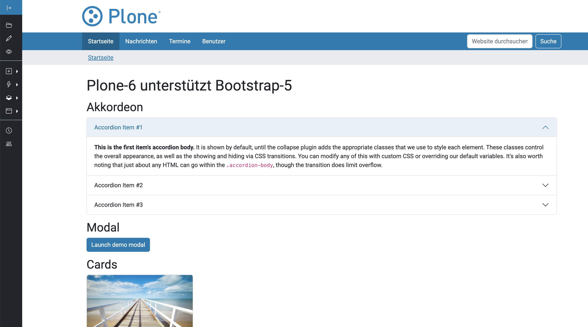

# plone6_buildout

Installationsprozedur für die Plone-6-Installationen der SIGUV-Kooperation

Installation
============

Aktuelles Zielsystem für Plone Version 6.0.7
--------------------------------------------

- Ubuntu 22.04 LTS
- Python 3.10.6

Vorbereitung des Ubuntu-Systems
-------------------------------

* sudo apt-get install build-essential python-dev-is-python3 libjpeg-dev libxslt-dev supervisor git tox
* sudo apt-get install libpython3-dev
* sudo apt-get install python3-pip python3-venv
* sudo apt-get install libssl-dev libffi-dev
* sudo apt-get install libsasl2-dev libldap2-dev
* (Optional) sudo apt-get install mongodb
* (Optional) sudo apt-get install libpango-1.0-0 gir1.2-pangoft2-1.0

Binaries zum Indexieren von Content
-----------------------------------

* sudo apt-get install wv
* sudo apt-get install poppler-utils

Vorbereitung und Durchführung des Plone-Buildouts
-------------------------------------------------

* ~ > git clone https://git.bg-kooperation.de/uvcplone/plone6_buildout.git $projectname
* ~ > cd $projectname
* ~/$projectname > python3 -m venv .
* ~/$projectname > ./bin/pip install -r requirements.txt
* ~/$projectname > ./bin/buildout


Anpassung der buildout.cfg nach git clone
-----------------------------------------

* user=admin:admin
* Portnummern der Clients
* Portnummer des ZEO-Servers
* shared-blob --> bei 2. Server ohne lokale Datenbank shared-blob = off


Buildout für eine bestimmte Plone-Version (6.0.0)
=================================================

Der Master- bzw. Main Branch des Buildouts rlaubt die Installation der jeweils aktuellen Plone6-Version für
ein definiertes Zielsystem (siehe oben). Für ältere Installationen (Bestand an Portalen)
kann es aber durchaus sinnvoll sein, explizite Buildouts älterer Plone-Stable-Releases durchzuführen.
Beginnend mit Version 6.0.0 werden versionsspezifische Kopien aller erforderlichen Dateien im Buildout
gepflegt. Aktuell sind das folgende Dateien:

* requirements.txt -> requirements-${version}.cfg
* profiles/versions.cfg -> profiles/versions-${version}.cfg

Abweichender Installationsablauf
--------------------------------

* ~ > git clone https://git.bg-kooperation.de/uvcplone/plone6_buildout.git $projectname
* ~ > cd $projectname
* ~/$projectname > python3 -m venv .
* ~/$projectname > ./bin/pip install -r requirements-${version}.txt
* ~/$projectname > vi buildout.cfg

```
[buildout]

extends = 
    profiles/develop.cfg
    profiles/${version}/version.cfg
    profiles/versions-${version}.cfg
``` 
* ~/$projectname > ./bin/buildout

Aktuelles Zielsystem für Plone Version 6.0.2
--------------------------------------------

- Ubuntu 22.04 LTS
- Python 3.10.6

Zielsysteme für Plone Version 6.0.0
-----------------------------------

- Ubuntu 22.04 LTS
- Python 3.10.6

Update des Systems auf neue Plone-Versionen
===========================================

Der Buildout muss regelmäßig auf neue Versionen der Frameworks Plone und Zope angehoben werden. In diesem Fall muss
geprüft werden, ob die Version-Pins der SIGUV-Gemeinschaft in der ./profiles/versions.cfg noch mit den Versionen
kompatibel sind, die frameworkseitig mitgeliefert werden. Um diesen Prozess zu erleichtern kann ein Scriptdatei
verwendet werden die mit dem Buildout ausgeliefert wird:

~/$projectname > ./bin/python check_versions.py

In der Datei müssen vor Ausführung folgende Änderungen vorgenommen werden:

* ploneversion = 'x.x.x'
* zopeversion = 'x.x.x'

Die Ausgabe hat dann etwa folgendes Format:

```
setuptools: versions.cfg:51.3.3 release-5.2.9-versions.cfg:42.0.2
importlib-metadata: versions.cfg:5.0.0 release-5.2.9-versions.cfg:0.23
SecretStorage: versions.cfg:3.3.1 release-5.2.9-versions.cfg:2.3.1
```

Screenshot
----------




Ansprechpartner
---------------
- Lars Walther (lwalther@novareto.de)
- fachlich: Holger Zingsheim (BG ETEM)

Maintainer
----------

- Lars Walther (lwalther@novareto.de)
